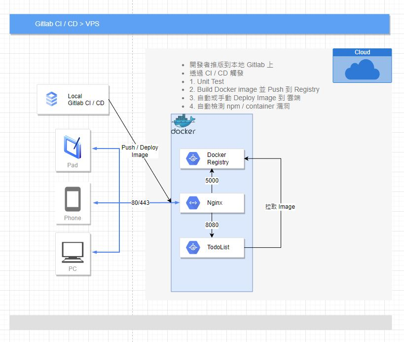

# Todo List 搭配 CI / CD 練習

程式語言：Typescript

運行環境：Linux 架設 Gitlab、Registry，Runner 則運行在 Kubernetes。

流程：當開發者推版到 Gitlab 時，透過 CI / CD 佈署到目標服務上，並做漏洞檢測

## 示意圖

## Gitlab Pipeline

## 佈署 Todo List

[Todo List](https://demo.gooto.cyou/todolist/)

## 漏洞檢查

[Image 掃描漏洞報告](attach/container_scanning.log)

